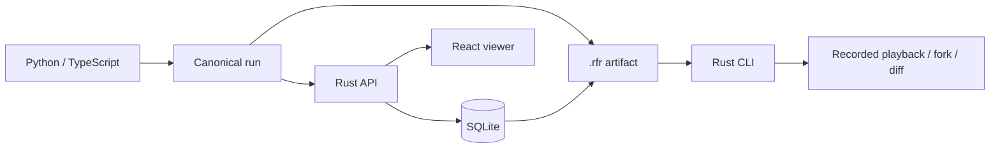

# Architecture

The portable execution is the boundary between application instrumentation and infrastructure.
All adapters produce `refract.execution.v1`; the Rust model validates runs before storage or replay.

| Crate             | Responsibility                                  | Foundation status            |
| ----------------- | ----------------------------------------------- | ---------------------------- |
| refract-core      | Execution model, validation, baseline redaction | Implemented                  |
| refract-artifact  | Bounded deterministic ZIP, SHA-256 verification | Implemented                  |
| refract-replay    | Recorded output playback and prefix forks       | Implemented                  |
| refract-diff      | Ordered semantic comparison                     | Implemented                  |
| refract-storage   | Immutable run snapshots, SQLx migrations        | SQLite implemented           |
| refract-collector | Native normalization boundary                   | Native JSON only             |
| refract-server    | Versioned REST and static viewer                | Implemented for local use    |
| refract-cli       | Offline artifact workflows and local server     | Implemented                  |
| refract-protocol  | Shared protocol boundary                        | Protobuf draft; gRPC planned |

Run snapshots are immutable. A fork has a new run ID, preserves prior event IDs within that run,
and records lineage. It contains events before the selected event and stays `running`.
Execution continuation, deterministic re-execution and live replay require future executors.
Recorded playback is a list of captured outputs, not a reconstruction of arbitrary application code.

Events form an ordered graph: parents must precede children. Diff compares event positions and parent
positions, inputs, outputs, status, attributes and policy. It ignores generated identifiers and timing;
it is not a causal graph matcher or a latency/cost analysis engine.

The default server is a local developer tool without authentication. It binds loopback on the host;
Docker binds internally on all interfaces but publishes only to host loopback. Native ingestion is
limited to 16 MiB per request. Listing returns at most the latest 100 complete run snapshots.
No service should be exposed publicly until authentication, pagination, retention, and rate limiting
are implemented. SQLite is the only connected storage backend in this milestone.

See [roadmap](docs/roadmap.md) for subsequent milestones.
