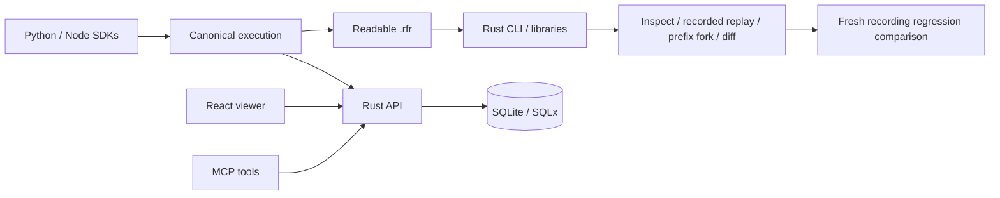

# Architecture

The canonical execution model is shared by the Rust engine and language-neutral JSON schemas.
SDKs produce snapshots; the native collector validates/redacts them before SQLite persistence.
REST, the viewer and MCP operate on those snapshots. The CLI and Rust libraries can work offline.

Runs are immutable snapshots. Events form an ordered parent graph: a parent must precede its child.
A fork gets a new run ID, retains prefix event IDs within that run and records lineage. It stays running
until a future continuation mechanism exists. Diff compares event positions, parents, inputs, outputs,
attributes, status and replay policy; generated IDs and timing are ignored.

New artifacts use a checksummed text profile. Rust also reads the legacy ZIP profile. Readers do not
execute embedded code. The API lists at most 100 full snapshots and limits request bodies to 16 MiB.
See [repository map](repository.md), [format](usage/artifacts.md) and [production boundaries](production.md).
