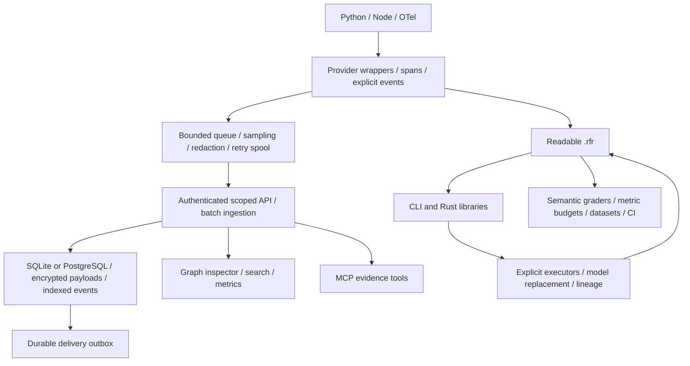

# Execution architecture

Runs remain immutable snapshots. Parent events precede their children, and graph visualization uses
recorded relationships. Forking creates a prefix; executable rerun invokes explicitly chosen trusted
application handlers for the suffix. No executable command comes from the artifact itself.

Measurement attributes extend the v1 execution model without a format break. Raw comparison remains
available alongside pluggable output grading and budget evaluation. UTF-8 artifacts preserve the
checksummed payload; Rust still reads legacy ZIP recordings.

See [repository map](repository.md), [production operation](production.md),
[rerun](usage/rerun.md) and [evaluation](usage/evaluation.md) for boundaries and configuration.
