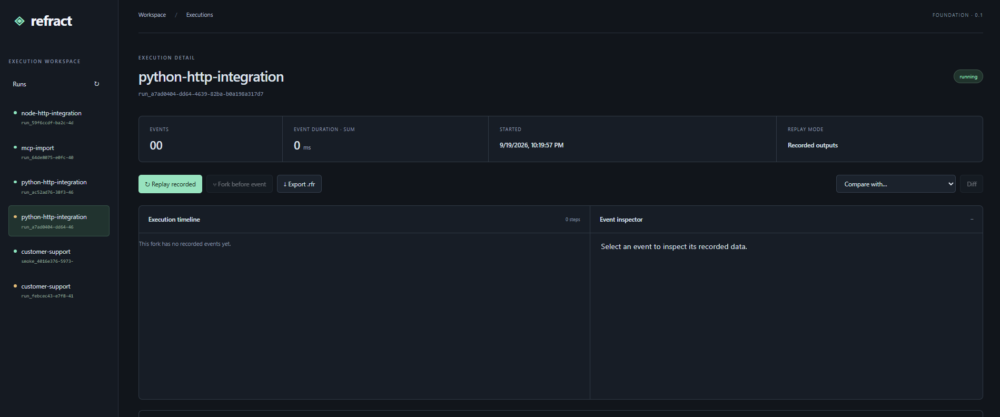
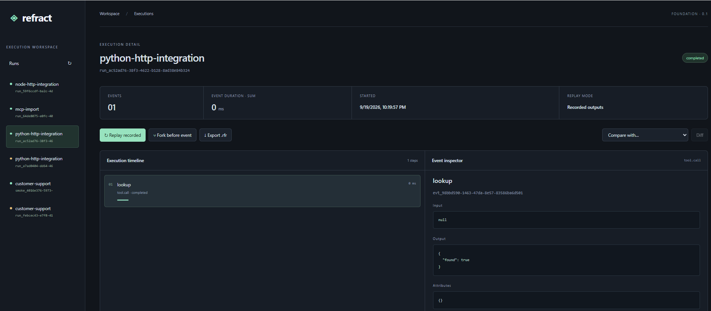
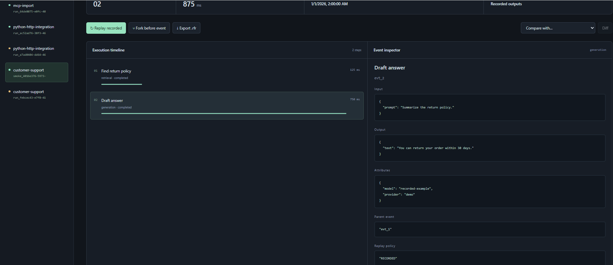

# Execution inspector

The inspector is the browser interface bundled with the Docker image. It reads the same REST API
used by the SDKs and MCP. Start the service with `docker compose up --build -d --wait`, open
<http://localhost:8000>, and submit an execution using an [SDK](python.md) or the
[HTTP example](../../examples/http/ingest.py). See [Docker usage](docker.md) for storage and networking.

## Search and authenticated workspaces

Use the sidebar search for run text and expand **Filter executions** to combine status, model,
tool name, and minimum duration in milliseconds. The UI calls `GET /v1/search` with structured query
parameters and paginates 100 matches at a time. Filters combine rather than replacing one another.

For a secured server enter a bearer API key in **API key (tab memory only)**. It is held in JavaScript
memory and sent on API calls and artifact downloads. Reloading the tab clears it; nothing is stored
in local storage or cookies. The server enforces the key's workspace and role. Reader keys can
inspect/compare/replay; ingest and fork require writer permission. Use HTTPS for remote deployments;
see [production configuration](../production.md).

## Execution graph and observability

The SVG graph draws recorded parent/child relationships. Independent roots remain separate; it does
not invent edges between consecutive events. Click a node or focus it and press Enter/Space to
select its recorded input, output, attributes, parent, and replay policy in the inspector. Zoom and
scroll the graph to navigate branches. The ordered timeline remains available underneath.

**Most expensive** and **Slowest event** select the relevant event. Wall latency uses the run's
start/end timestamps; it is different from summing overlapping span durations. TTFT is the mean of
available first-text measurements; cached usage and cost exist only when captured. Missing
measurements remain unknown. The comparison selector immediately shows recorded cost, latency,
tokens, TTFT and cached-token changes. **Diff** additionally returns the engine's event comparison.
Keep **Semantic comparison** enabled to see equivalent/changed event counts and per-event reasons.
The bundled offline grader normalizes token overlap and flags numeric/negation changes; it does not
establish factual truth or replace human review. Expand **Full execution result** for the exact report.

The screenshots below preserve the earlier timeline layout. They demonstrate the same recorded
examples and inspector fields; the current UI additionally includes graph, metrics, search, and API
key controls described above.

## Workspace and empty forks

Choose a run in the left sidebar. The summary shows recorded cost, wall latency, tokens, model/tool
call counts, mean first-text latency (TTFT), and cached input tokens. Missing measurements show `—`,
not zero. Cost and token cards show model-call coverage; partially instrumented recordings must not
be interpreted as complete billing totals. Cost uses application-configured rates. An empty fork is valid: forking before the first event preserves zero
events. It does not indicate that a model is executing in the background.

This screenshot shows an empty prefix branch. The event inspector has nothing to display until a run
with recorded events is selected; the running status is stored metadata, not a live worker indicator.

## Inspect a tool call

Select an event in the execution timeline to view its recorded input, output and attributes.
The example below selects `lookup`, a completed `tool.call` whose output is `{"found": true}`.
A `null` input means no input was recorded; a zero duration means the recording reports no elapsed time.

## Follow a multi-step execution

The timeline preserves event order. This example records retrieval followed by generation; selecting
`Draft answer` displays its prompt, captured answer, provider/model attributes, parent event and replay
policy. The duration bars help compare recorded step durations; their sum is not necessarily wall-clock
runtime when events overlap.

## Replay, branch, compare and export

1. **Replay recorded** returns captured outputs. It does not call a model or execute a tool.
2. **Fork before event** creates a stored prefix ending before the selected event. It preserves lineage
   but does not resume your application. Select a populated run and an event to enable it.
3. **Compare with…**, then **Diff**, compares the selected run with another recorded run. To test new
   application behavior, first record a fresh execution and then compare it with the baseline.
4. **Export .rfr** downloads a readable, checksummed execution artifact. Open it in a text editor or use
   `refract inspect` / `refract validate`; see the [format guide](artifacts.md).

These screenshots illustrate recorded example data, not a hosted demo. For a fresh graph with real
parent relationships and synthetic provider metrics, run the
[TypeScript instrumentation example](../../examples/typescript/instrumented/README.md) with
`REFRACT_ENDPOINT=http://localhost:8000` and select `instrumented-agent`.

Browser tests cover timeline actions, artifact export, graph selection, metrics, comparison,
structured search, and tab-scoped credentials. Run `npx playwright test -c apps/viewer/playwright.config.ts`
against a running current server, or set `REFRACT_SERVER_URL` for another test instance.
