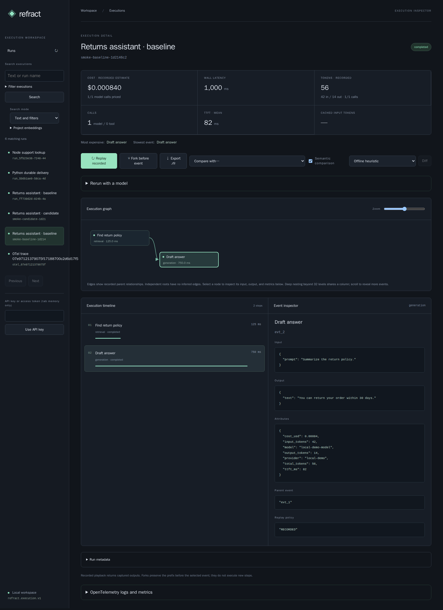
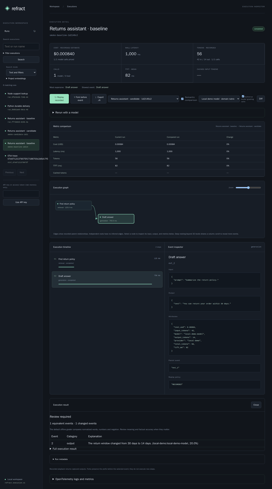
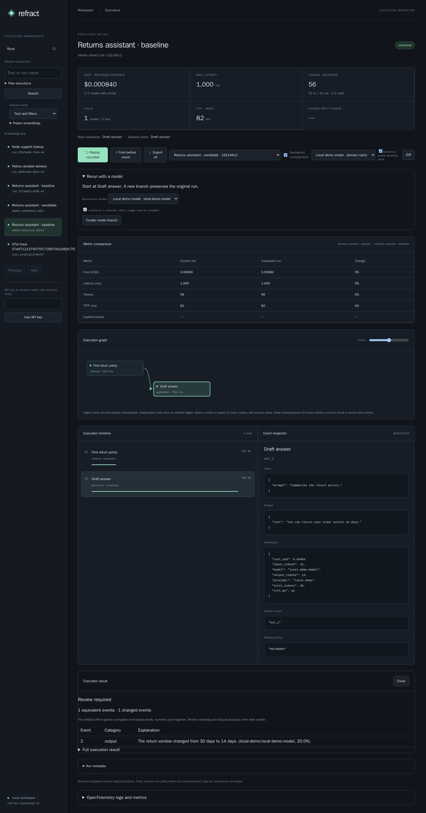
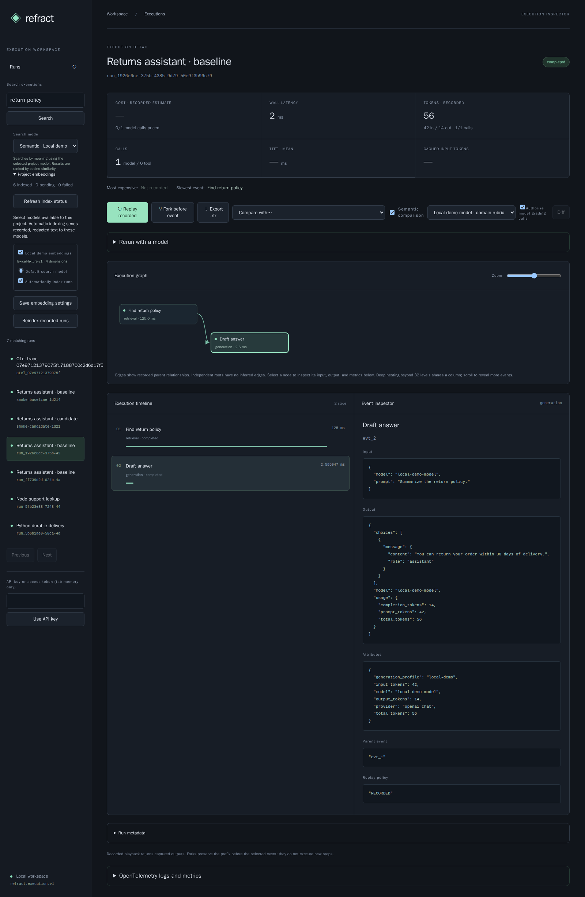
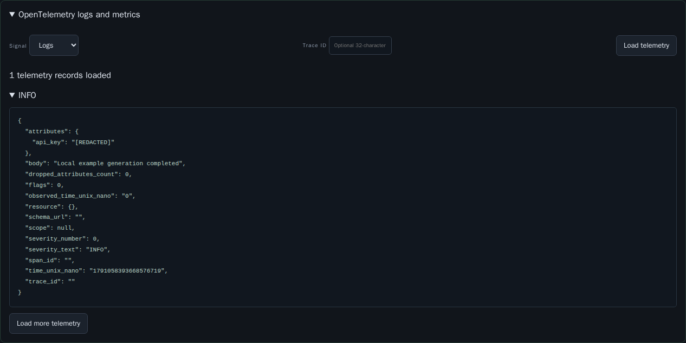

# Execution Inspector

The Inspector is the browser UI bundled with Refract's Docker image. It uses the same authenticated
REST API as the SDKs and MCP. Start with `docker compose up --build -d --wait`, open
<http://localhost:8000>, and submit a recording through an [SDK](python.md) or the
[HTTP example](../../examples/http/ingest.py).

[Watch the Inspector demo (WebM)](../../assets/Inspector_Demo.webm): inspect a recorded execution,
compare a policy change, create a model branch, select an embedding model and browse telemetry.

## Inspect an execution

Select a recording in the sidebar. The overview shows cost, wall latency, tokens, model/tool calls,
first-text latency and cached input tokens. Missing measurements display `—`; coverage indicates
whether every model call supplied the relevant measurement. Recorded estimates are not invoices.

The graph draws recorded parent/child relationships. Select a node to inspect its input, output,
attributes and replay policy. Independent roots remain separate. Zoom/scroll the graph for larger
executions; the ordered timeline also provides keyboard-accessible event selection.

This local fixture retrieves a 30-day return policy and drafts an answer. Its 56 tokens, 1,000 ms wall
latency, 82 ms first-text latency and $0.000840 estimate are deliberately supplied test measurements.
The screenshots capture the current UI against a running service; they are not design mockups.

## Compare behavior and budgets

Choose **Compare with…** to display measurement deltas, then **Diff** for the engine's event comparison.
**Semantic comparison** adds equivalent/changed counts and explanations. The offline grader uses
text normalization, token overlap and numeric/negation checks. For a configured domain rubric, select
a **Semantic grader** and authorize its provider calls. Missing or invalid model judgments fail the
comparison instead of assuming success. Expand **Full execution result** for the full report.

The candidate changes the deadline from 30 days to 14 days. The local mock grader deliberately reports
a mismatch; this example demonstrates the workflow, not a model-quality benchmark. See
[evaluation](evaluation.md) for dataset and budget configuration.

## Playback, branches and model experiments

- **Replay recorded** returns captured outputs under the recording's policy. It makes no model call.
- **Fork before event** stores the prefix before the selected event. An empty prefix is valid.
- **Rerun with a model** calls an operator-approved generation profile and saves a new branch.
  Authorize live calls and explicitly approve/reuse applicable suffix events before execution.
- **Export .rfr** downloads a readable, checksummed artifact for SDKs, CLI tools and regression checks.

Model reruns preserve the source recording. Their panel resets consent when the selected run, event
or credentials change. Application tool execution belongs in trusted SDK/CLI handlers; a recording
cannot supply arbitrary executable code. See [rerun modes](rerun.md) and [artifact format](artifacts.md).

## Search and embedding selection

Use **Search executions** with structured status/model/tool/latency filters, or select a project
embedding profile in **Search mode**. Project administrators can enable profiles, select the default
and configure automatic indexing under **Project embeddings**. Provider endpoints and credentials
remain operator configuration; they are never exposed in the picker.

Text search generates a query embedding with the selected model and searches its matching namespace.
The demo's small local lexical vector fixture verifies this connection; production profiles can use
approved local or hosted embedding models. See [search configuration](search.md).

## Logs and metrics

Expand **OpenTelemetry logs and metrics**, choose a signal and load records. Logs can be filtered by
trace ID; each record expands to show its normalized resource, scope and attributes. Metrics preserve
exported data points and temporality. These records are separate from replayable run snapshots.

See [OTLP ingestion](otel.md#logs-and-metrics) for HTTP/protobuf/gRPC configuration and SDK/MCP queries.

## Authentication

Manually entered API keys/access tokens stay in tab memory and clear on reload. The server enforces
their scope and role on every request. Configured **Sign in with SSO** uses an encrypted server session
and an HttpOnly cookie, restores access after reload and provides **Sign out of SSO**. Use HTTPS beyond
trusted local development. See [identity and session controls](service-controls.md#browser-sso).

## Reproduce the captures

The images and WebM come from the [integrated local demo](../development.md#integrated-local-stack-and-inspector-media),
using PostgreSQL and deterministic model/delivery fixtures. Run `tools/dev/capture-inspector.mjs` after
the combined smoke to recreate the scenes. Browser tests cover capture actions, artifacts, search,
graphs, comparison, credentials, persistent SSO UI, model consent and telemetry.
